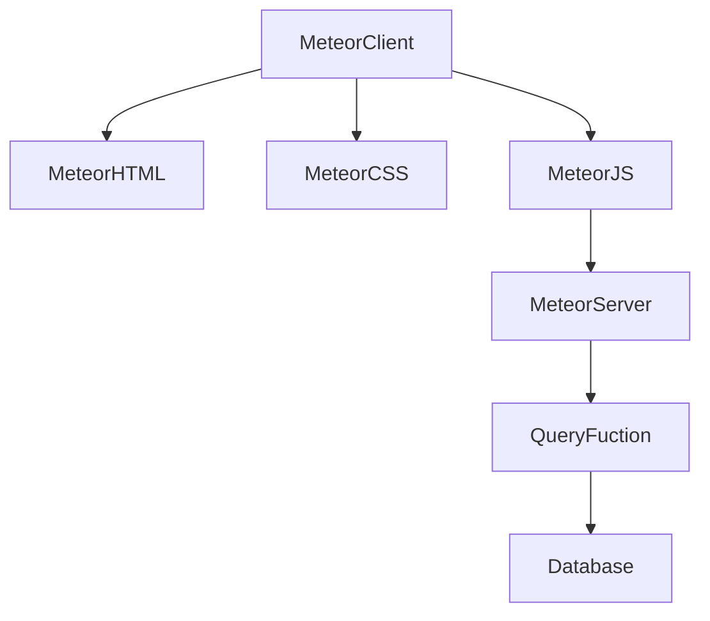
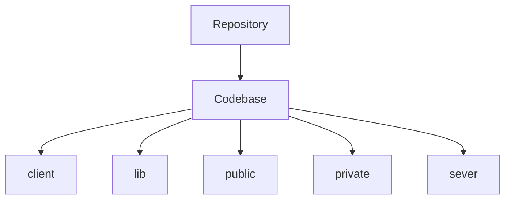
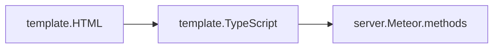
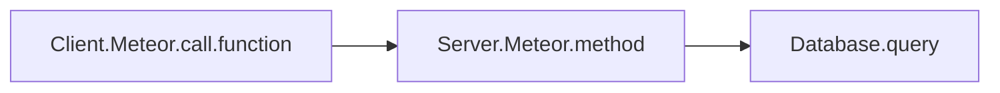

# Divine-Machinations

- Apps https://galaxy-beta.meteor.com/zbomb/us-east-1/apps

- Container(s) https://galaxy-beta.meteor.com/zbomb/us-east-1/apps/machinations.meteorapp.com/overview

- Demo [machinations](https://machinations.meteorapp.com)

- Repo https://github.com/Zbeyer/Divine-Machinations

```bash
sh start.sh
```

Front end web revolves around these three: `HTML | CSS | JS`

**HTML**: frameworks: what is on the screen

**CSS**: beautification: make it look pretty

**JS**: functionality: make it do something

## What is Blaze?

BlazeJS is a **reactive UI library** designed for building user interfaces with **HTML templates**. Basically a templating tool for reused JS and HTML

## What is Meteor?

Meteor (or MeteorJS) is a **full-stack JavaScript framework** designed for building **real-time web and mobile applications**. It simplifies development by allowing developers to use **JavaScript for both client-side and server-side code**

Essentially Meteor is a wrapper around `Node.js` that lets you incorporate a database without using something like `express`. By defaualt it uses `MongoDB`, a no-SQL database and talks to *its* server with `Meteor.call` and queries mongo from the server

```ts
await ServerDB.updateUser(
    { _id: user._id },
    {
        $set: {
            "user.dataId": iDstring,
        },
    },
);
```




# Web Architecture Skinny

In web design and development, **RESTful** refers to a web architecture that follows the principles of **Representational State Transfer (REST)**. REST is a widely used standard for building **scalable and efficient web services** and is used to make websites use CRUD:

`GET` (Retrieve data)

`POST` (Create new data)

`PUT` (Update data)

`DELETE` (Remove data)

CRUD stands for **Create, Read, Update, and Delete**—the four basic operations that can be performed on a database.

The language I like to use:

-   `fetch` data :get or read
-   `set` data: post, create, or update
-   `delete` or clear wipe data

## Organize



Our reposory is GitHub, this is where we store code

`Client` is a folder that only loads on the Meteor Client. That means it only affects how users see and interact with the site. CSS should stay here.This is all the user will see.

`lib` is a folder that will go in both server and client, helper functions like 1+1=2 that need to work on the front and back ends go here

`Public` is a folder for files that should be public, images go here.

`private`is a folder that can only be easily accessed by the server, put stuff here if you want to use it in the website but only viewable on certain pages. Do NOT recommend using this as key storage because they can be hijacked from the repository with ease.

`Server` is a folder that is back end only, database queries go here.

# Patterns

## Front End



### register.html

```html
<template name="register">
	<h2>Register</h2>
	<form id="registerForm">
		<label for="register-username">Username:</label>
		<input type="text" id="register-username" autocomplete="username" name="username" required>

		<label for="register-email">Email:</label>
		<input type="email" id="register-email" autocomplete="email" required>

		<label for="register-password">Password:</label>
		<input type="password" id="register-password" autocomplete="password" name="password" required>

		<button type="submit" class="register-button">Register</button>
	</form>
</template>
```

### Register.js

```js
const makeNewUser = function (event) {
	event.preventDefault();

	let usernameInput = document.getElementById("register-username");
	let emailInput = document.getElementById("register-email");
	let passwordInput = document.getElementById("register-password");

	if (!usernameInput || !emailInput || !passwordInput) {
		console.error("One or more input fields are missing from the DOM.");
		return;
	}

	let username = usernameInput.value;
	let email = emailInput.value;
	let password = passwordInput.value;

	if (!(username || email || password)) {
		console.error("One or more input fields are empty.");
		return;
	}

	Meteor.call("registerUser", { username: username, email: email, password: password }, function (error, result) {
		if (error) {
			console.error("Registration failed: %o", error);
			return;
		}
		alert("User registered successfully! User ID: " + result);
	});
};


Template.register.events({
	'submit #registerForm': function (event) {
		makeNewUser(event);
	},
	'click .register-button': function (event) {
		makeNewUser(event);
	},
	'keyup input': function (event) {
		if (event.keyCode === 13 || event.key === "Enter") {
			makeNewUser(event);
		}
	}
});
```

### Accounts.js on the server

```js
import { Meteor } from 'meteor/meteor';
import { Accounts } from 'meteor/accounts-base';
import { check } from 'meteor/check';

Meteor.methods({
	async registerUser(userData) {
		check(userData, {
			username: String,
			email: String,
			password: String
		});

		const existingUser = await Meteor.users.findOneAsync({ "emails.address": userData.email });

		if (existingUser) {
			throw new Meteor.Error(403, "Email is already in use.");
		}

		const userId = Accounts.createUser({
			username: userData.username,
			email: userData.email,
			password: userData.password
		});

		return userId; // Returns the new user's ID
	}
});
```


## Remote Procedure Calls (RPCs)



### Client

```js
Meteor.call("registerUser", { username: username, email: email, password: password }, function (error, result) {
//...
```

### Server

```js
Meteor.methods({
	async registerUser(userData) {
//...
```

### Query

```js
//...
const existingUser = await Meteor.users.findOneAsync({ /
const userId = Accounts.createUser({
    username: userData.username,
    email: userData.email,
    password: userData.password
});
//...
```

